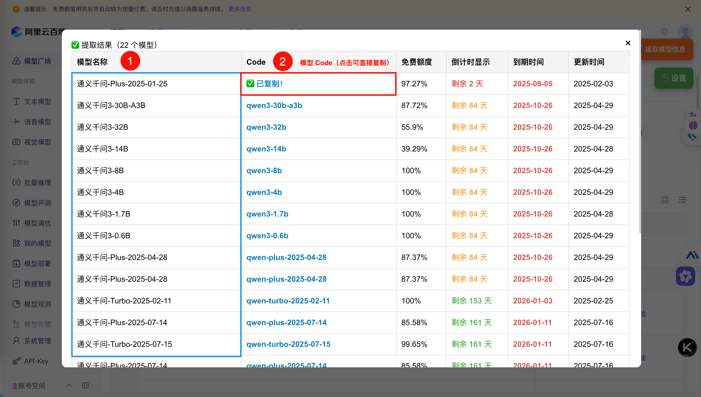

以下是为你准备的 GitHub 项目 `README.md` 文件内容，包含中英文双语介绍、安装说明、使用指南、更新日志和贡献方式等内容，结构清晰、符合开源项目规范：

---

# 🧾 阿里云百炼模型到期时间提取器 / Bailian Model Expiry Extractor

[](https://opensource.org/licenses/MIT)
[](#installation)
[](#installation)

> 🧩 一个用于阿里云百炼平台的油猴脚本，可一键提取模型名称、Code、免费额度、倒计时、到期时间等信息。
> 🧰 A Tampermonkey script to extract model name, code, quota, countdown, and expiry date from Alibaba Cloud Bailian Console.

---

## 🌍 简介 / Introduction

本脚本专为阿里云百炼平台设计，可一键提取模型市场中的模型信息，包括：

- ✅ 模型名称（Model Name）
- ✅ 模型 Code（如：`qwen-plus`）
- ✅ 免费额度（支持百分比、N/M 格式、无额度显示）
- ✅ 倒计时天数（按剩余天数排序）
- ✅ 到期时间（精确匹配 `YYYY-MM-DD` 格式）

此外，还支持：
- 🔍 自动切换为列表视图
- 📦 自动展开折叠区域
- 📋 一键复制模型 Code
- 📊 支持导出为 CSV 表格
- ⚙️ 可自定义显示列（如模型类型、上下文长度等）

> ⚠️ 请确保已登录阿里云并进入【模型市场】页面再点击提取按钮。
> ⚠️ 【模型市场】主页面提取需要先手动「点击切换列表显示」->「点击展开」
> ⚠️ 单个模型的「详情页面」则直接点击『提取模型信息』即可

---

## 🖼️ 效果图 / Screenshots




---

## 🧰 安装方式 / Installation

### 方法一：通过 GreasyFork 安装（推荐）

👉 [点击安装 Bailian Model Expiry Extractor](https://greasyfork.org/scripts/xxxxxx)（替换为你的实际链接）

### 方法二：手动安装

1. 安装 [Tampermonkey](https://www.tampermonkey.net/) 或 Violentmonkey 浏览器扩展；
2. 下载本仓库中的 `.user.js` 文件；
3. 在 Tampermonkey 管理面板中新建脚本，粘贴内容并保存。

---

## 🧪 使用方法 / How to Use

1. 打开阿里云百炼平台：[https://bailian.console.aliyun.com/console](https://bailian.console.aliyun.com/console)
2. 进入【模型市场】页面；
3. 点击右上角的 `📊 提取模型信息` 按钮即可提取并查看数据；
4. 可通过 `⚙️ 设置` 按钮自定义显示字段；
5. 点击任意模型 Code 即可一键复制；
6. 点击 `📋 复制为 CSV` 按钮可导出为标准 CSV 表格。

---

## ⚙️ 自定义设置 / Customization

点击页面右上角的 `⚙️ 设置` 按钮，可选择显示以下额外字段：

- 模型类型
- 上下文长度
- 价格
- 模型协议
- 限流
- 描述
- 供应商（仅主页面）
- 更新时间（仅主页面）


---

## 🧾 导出功能 / Export

点击弹窗中的 `📋 复制为 CSV` 按钮，即可将当前提取结果复制为标准 CSV 格式，便于粘贴至 Excel、Google Sheets 等工具中进行分析。

---

## 🧪 兼容性 / Compatibility

- ✅ Tampermonkey（推荐）
- ✅ Violentmonkey
- ⚠️ Greasemonkey（部分功能可能受限）

---

## 📦 更新日志 / Changelog

### ✅ v1.4.3

- 🛠 修复部分模型页面 Code 识别失败的问题；
- 🎯 优化倒计时颜色显示逻辑；
- 🧩 增加设置面板，支持自定义显示字段；
- 🧾 增加 CSV 导出功能；
- 📦 自动展开折叠项，提升提取准确性；
- 🧪 支持子页面模型详情提取。

---

## 🐞 问题反馈 / Bug Report

如遇到问题，请前往 GitHub 提交 Issue：

🔗 [https://github.com/jwq2011/TamperMonkey-Scripts/issues](https://github.com/jwq2011/TamperMonkey-Scripts/issues)

---

## 💬 贡献与建议 / Contribution

欢迎提交 PR 或建议，帮助脚本更完善！

### 提交 Issue 模板（示例）

请使用 `.github/ISSUE_TEMPLATE/bug_report.md` 提交问题，格式如下：

```markdown
## 描述问题
（请简要描述你遇到的问题）

## 页面链接
（请提供你遇到问题的阿里云百炼页面链接）

## 截图
（如有，请上传截图说明）

## 控制台日志（可选）
（按 F12 打开开发者工具，复制 Console 中的错误信息）
```

---

## 📄 许可证 / License

本项目采用 MIT 协议开源，详见 [LICENSE](LICENSE) 文件。

---

## 📬 作者 / Author

👤 **will**
🔗 [GitHub Profile](https://github.com/jwq2011)

---

如需 `.github/ISSUE_TEMPLATE/bug_report.md` 模板内容，我也可以为你生成。是否需要？